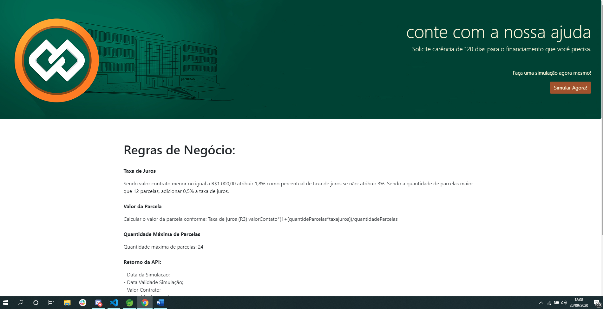
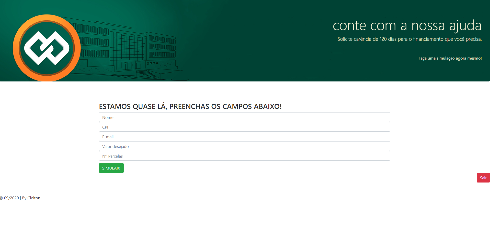
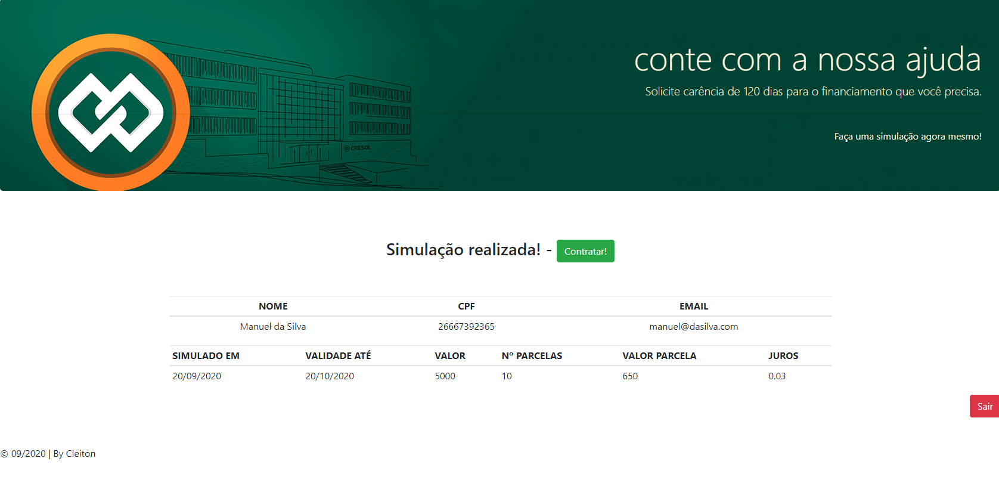
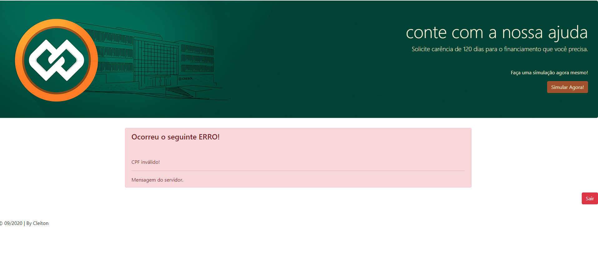

# Simulador de Financiamento

#### Esta aplicação foi desenvolvida especificamente para fins didáticos e mesmo contendo imagens ilustrativas não possui vínculo com nenhuma instituição financeira ou de credito. 

*Obs.: em caso de erro de cors recomendo criar uma instancia do google chorme sem o cors, basta criar um novo atalho para o chrome adicionando esta tag "--disable-web-security --disable-gpu --user-data-dir=c:/chromeTemp" no final do destino. 

Aplicativo SPA híbrido (compatível com celular, tablet, computador, etc...) para simulação de empréstimo.

### Pré-Requisito: 
Estar com a api "Simulador_Emprestimo_banckAnd" rodando. Você pode baixa-la neste link: https://github.com/infortic/Simulador_Emprestimo_banckAnd, leia o readmin para saber coomo configurar e subir a API. :)

### Parâmetros de Entrada: 
- NOME
- CPF
- EMAIL
- VALOR_CONTRATO
- QUANTIDADE_PARCELAS.

### Parâmetros de Saída:
- Dados do cliente;
- Data da Simulacao;
- Data Validade Simulação;
- Valor Contrato;
- Quantide de Parcelas;
- Valor Parcela;
- Taxa Juros Emprestimo.

### Tela Inicial

### Tela de INPUT

### Tela de OUTPUT

### Tela de ERRO

## Executando o projeto

### Pré-requisitos
* Node.JS
* Internet (algumas dependências possuem diretórios remotos)

### Passo a passo

1 - Execute a linha de código a baixo para baixar a branch da aplicação: 
`git clone https://github.com/infortic/FrontAndProcessManegemet.git`

2 - Dentro da pasta do sistema execute: 
`npm install`
para baixar as dependências do Node.js

3 - Ainda dentro da pasta da aplicação execute: 
`npx serve`
se tudo ocorreu bem a aplicação estará disponível’ no seguinte link: `localhost:5000` 
ao acessar deverá chegar a tela inicial do sistema!

